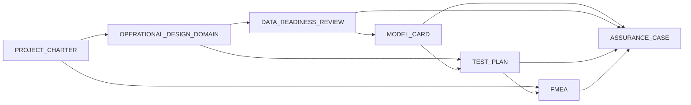

# ML Assurance Documentation Templates

Reusable Markdown templates for documenting professional Machine Learning projects in embedded, aerospace
and space domains.

> ⚠️ **Disclaimer — ECSS-informed, not ECSS-certified.**
> These templates are inspired by the good practices described in the ECSS-E-HB-40-02A handbook for
> Machine Learning and by ML verification, data assurance and risk-based testing principles. They do
> **not** claim ECSS compliance, conformity, certification or qualification. Do not present any document
> produced with these templates as ECSS-certified.

## Purpose

The templates help an engineering team produce a coherent, reviewable documentation set for an ML project
covering: the operational problem, the decision to use ML (or not), data quality, the Operational Design
Domain (ODD), the selected model, the verification strategy, failure analysis and the overall assurance
case.

The documents are:

- written in plain, portable Markdown (readable without special tooling);
- reusable across different projects;
- self-explanatory: each section tells you **what** to write and **how** to complete it;
- traceability-friendly: every requirement, ODD condition, risk, test, evidence and assumption carries a
  stable identifier.

## Scope

Suitable for systems where one or more ML constituents interact with embedded platforms, sensors,
telemetry, autonomy functions or mission software. Applicable to feasibility studies, development,
verification, integration and operational monitoring.

## Document set

| # | Document | Answers the question | Primary focus |
|---|---|---|---|
| 1 | `PROJECT_CHARTER.md` | Why are we doing this, and should it be ML at all? | Problem, value, requirements, ML vs non-ML decision |
| 2 | `OPERATIONAL_DESIGN_DOMAIN.md` | Under which conditions is the ML allowed to operate? | ODD conditions, boundaries, coverage vs data and tests |
| 3 | `DATA_READINESS_REVIEW.md` | Are the data adequate before model selection? | Inventory, quality, representativeness, decision |
| 4 | `MODEL_CARD.md` | Which model was selected and why? | Architecture, selection rationale, metrics, limits |
| 5 | `TEST_PLAN.md` | How is the system verified? | Test levels, methods, traceability, evidence |
| 6 | `FMEA.md` | What can fail, and how is each failure mitigated? | Functional failure modes, effects, controls |
| 7 | `ASSURANCE_CASE.md` | What arguments and evidence support trust? | Claims, arguments, evidence, defeaters |

`README.md` (this file) is the central guide and is **not** copied into a project.

## Recommended completion order

The order below is iterative — documents influence each other and must be updated together:

1. `PROJECT_CHARTER.md` — establish problem, requirements and the ML decision.
2. `OPERATIONAL_DESIGN_DOMAIN.md` — define where the ML is allowed to operate.
3. `DATA_READINESS_REVIEW.md` — confirm the data cover the ODD and support training/verification.
4. `MODEL_CARD.md` — document the selected model and justify the choice.
5. `TEST_PLAN.md` — verify requirements, ODD conditions and failure modes.
6. `FMEA.md` — analyse functions and failures of the ML constituent and its system context.
7. `ASSURANCE_CASE.md` — assemble claims and evidence.

> **Instructions:** do not treat this as a waterfall. A change in the ODD typically triggers a data review,
> new tests and updated claims. Track every change through the document control and decision log of the
> affected files.

## Relationships between documents



Plain-text equivalent of the relationships:

- `PROJECT_CHARTER` states requirements → `OPERATIONAL_DESIGN_DOMAIN` refines them into ODD conditions →
  `DATA_READINESS_REVIEW` maps ODD conditions to data coverage → `MODEL_CARD` records the model and its
  metrics → `TEST_PLAN` verifies requirements, ODD and failure modes → `FMEA` analyses failures and maps
  them to requirements/tests → `ASSURANCE_CASE` binds claims to evidence from all documents.

## Identifier conventions

| Prefix | Identifier | Used for |
|---|---|---|
| `REQ-F-` | `REQ-F-001` | Functional requirements |
| `REQ-NF-` | `REQ-NF-001` | Non-functional requirements |
| `REQ-I-` | `REQ-I-001` | Interface requirements |
| `ODD-` | `ODD-001` | ODD conditions |
| `DATA-` | `DATA-001` | Data requirements or data sources (use a `Type` column to disambiguate) |
| `RISK-` | `RISK-001` | Project risks |
| `FM-` | `FM-001` | Failure modes |
| `TEST-` | `TEST-001` | Test cases |
| `EVID-` | `EVID-001` | Evidence items |
| `ASM-` | `ASM-001` | Assumptions |
| `LIM-` | `LIM-001` | Limitations |
| `ACT-` | `ACT-001` | Open actions |
| `ARG-` | `ARG-001` | Assurance claims/arguments |
| `NC-` | `NC-001` | Data non-conformities |
| `DEC-` | `DEC-001` | Decision-log entries |

Rules:

- Identifiers are unique within the project documentation set.
- Identifiers never change once allocated; revisions change the document version, not the ID.
- A requirement may appear in several documents, but it is **owned** by one document (see the coverage
  matrix below); the others reference it.
- Referenced IDs must exist somewhere in the document set — the final checklist of each document verifies
  this.

## Traceability rules

Traceability links flow in both directions:

- Requirements → ODD conditions → data → tests → evidence → assurance claims.
- Risks/failure modes → requirements → tests → evidence.

Use the matrices provided in each template:

- `DATA_READINESS_REVIEW`: ODD-condition coverage table.
- `OPERATIONAL_DESIGN_DOMAIN`: ODD-to-data and ODD-to-test coverage matrices.
- `TEST_PLAN`: traceability matrix `(TEST, REQ, ODD, RISK/FM, method, dataset, status, evidence)`.
- `FMEA`: each row links `FM` to `REQ` and `TEST` and, in the assurance case, to `ARG`/`EVID`.
- `ASSURANCE_CASE`: each claim lists supporting evidence; the Evidence Index holds the full registry.

## Versioning rules

- Start every new document at `Version 0.1.0`, `Status Draft`.
- Increment the version on any content change (`0.1.x` = draft edits, `1.0.0` = first approved release).
- Keep the `Last updated` date in the Document Control in sync with the last commit touching the file.
- Never reuse a version number.

## Document states

| State | Meaning |
|---|---|
| `Draft` | Under development; not reviewed. |
| `In Review` | Content frozen for review cycle; changes require a new review. |
| `Approved` | Reviewed and accepted by the owner and named reviewers. |
| `Superseded` | Replaced by a newer version; kept for traceability. |

## Review process

1. Author completes the template and marks `Status: Draft`.
2. Author requests review; owner sets `Status: In Review`.
3. Reviewers check completeness (per-file checklist), consistency of identifiers and traceability.
4. Comments are resolved and recorded in the Decision Log.
5. Owner sets `Status: Approved` and bumps the version.
6. A later change supersedes the approved version rather than editing it silently.

## Starting a new project

Copy the seven templates (all files except `README.md`) into your project documentation folder.

Manual copy:

```bash
PROJECT=my-ml-project
mkdir -p "$PROJECT/docs/assurance"
for f in PROJECT_CHARTER OPERATIONAL_DESIGN_DOMAIN DATA_READINESS_REVIEW MODEL_CARD TEST_PLAN FMEA ASSURANCE_CASE; do
  cp templates/ml-assurance/$f.md "$PROJECT/docs/assurance/$f.md"
done
```

Scripted copy (non-destructive, dry-run option, help):

```bash
python3 templates/ml-assurance/scripts/init_project.py --help
python3 templates/ml-assurance/scripts/init_project.py --dry-run my-ml-project
python3 templates/ml-assurance/scripts/init_project.py --dest-dir . my-ml-project
```

The script refuses to overwrite existing files and only replaces the `Project` placeholder and the
document IDs with the project short name prefix, if requested (see `--prefix`).

## Example project document structure

```text
my-ml-project/
├── docs/
│   └── assurance/
│       ├── PROJECT_CHARTER.md
│       ├── OPERATIONAL_DESIGN_DOMAIN.md
│       ├── DATA_READINESS_REVIEW.md
│       ├── MODEL_CARD.md
│       ├── TEST_PLAN.md
│       ├── FMEA.md
│       └── ASSURANCE_CASE.md
├── data/              # dataset inventory, hashes, split manifests
├── models/            # model artefacts + hashes
└── evidence/          # test reports, logs, screenshots -> EVID-xxx references
```

## Coverage of the 15 mandatory aspects

| # | Aspect | Primary document | Referenced from |
|---|---|---|---|
| 1 | Operational problem | PROJECT_CHARTER | ODD, ASSURANCE_CASE |
| 2 | Motivation for using ML | PROJECT_CHARTER | MODEL_CARD, ASSURANCE_CASE |
| 3 | Comparison with a non-ML solution | PROJECT_CHARTER | MODEL_CARD, ASSURANCE_CASE |
| 4 | Functional requirements | PROJECT_CHARTER | ODD, TEST_PLAN, FMEA |
| 5 | Non-functional requirements | PROJECT_CHARTER | ODD, TEST_PLAN, FMEA |
| 6 | Operational Design Domain | OPERATIONAL_DESIGN_DOMAIN | DATA_READINESS_REVIEW, TEST_PLAN |
| 7 | Data description | DATA_READINESS_REVIEW | MODEL_CARD |
| 8 | Data quality report | DATA_READINESS_REVIEW | ASSURANCE_CASE |
| 9 | Selected model | MODEL_CARD | TEST_PLAN, ASSURANCE_CASE |
| 10 | Technical metrics | MODEL_CARD | TEST_PLAN, ASSURANCE_CASE |
| 11 | Risks and failure modes | FMEA (project risks in PROJECT_CHARTER) | TEST_PLAN, ASSURANCE_CASE |
| 12 | Test strategy | TEST_PLAN | FMEA, ASSURANCE_CASE |
| 13 | Deployment | PROJECT_CHARTER + ODD | MODEL_CARD, ASSURANCE_CASE |
| 14 | Limitations | Distributed; registry in ASSURANCE_CASE (`LIM-`) | every document |
| 15 | Future developments | PROJECT_CHARTER | — |

## Definition of Done (documentation)

A document is done when:

- Document Control is complete (no `[TO BE COMPLETED]` in the table for released documents);
- every section marked mandatory is completed or explicitly marked Not Applicable with justification;
- all identifiers referenced from this document exist in the document set;
- the final checklist of the document passes;
- links to related documents resolve;
- the document has been reviewed and its status reflects the outcome.

## New-project kickoff checklist

- [ ] Create the project folder structure (see example above).
- [ ] Copy the seven templates with the init script or manually.
- [ ] Complete `PROJECT_CHARTER.md` first (owner, reviewers, problem, requirements).
- [ ] Open actions (`ACT-`) are registered in the charter for all follow-ups.
- [ ] Establish the ID prefix convention (see `--prefix` option) before writing content.
- [ ] Verify the 15 mandatory aspects have a primary owner document.
- [ ] Add the documentation set to version control and configure review notifications.
