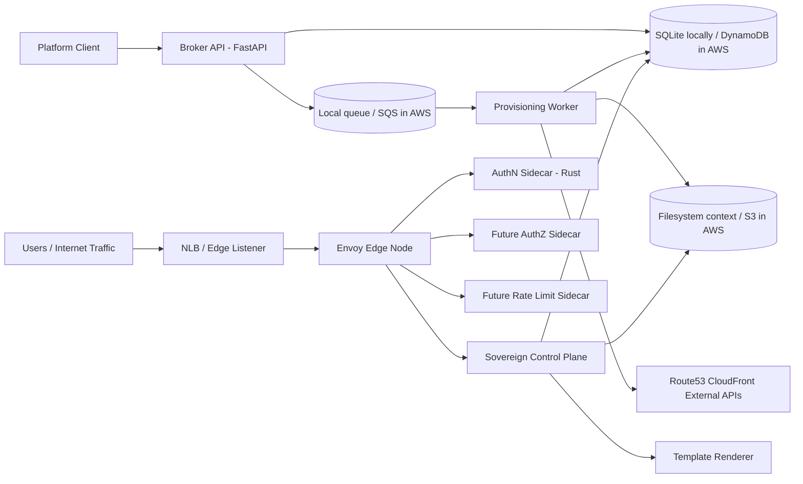

# Edge Load Balancer Platform

This repository is a local reference implementation of a self-service edge load balancing platform based on three core ideas:

- an asynchronous `Open Service Broker` style provisioning API
- a centralized `Envoy` control plane called `Sovereign`
- immutable infrastructure patterns for AWS edge fleets

The project is intentionally simple enough to run on a laptop while still matching the shape of a real production system.

In local mode, the platform uses:

- `FastAPI` for the broker and control plane
- `SQLite` instead of `DynamoDB`
- a local queue table instead of `Amazon SQS`
- filesystem-backed context files instead of `Amazon S3`
- simulated `Route53` and `CloudFront` outputs
- a Rust sidecar to model externalized authentication logic

In production, these local adapters map directly to AWS managed services and an edge fleet built around `Envoy`.

---

## Table of Contents

1. [Goals](#goals)
2. [Architecture Overview](#architecture-overview)
3. [Repository Layout](#repository-layout)
4. [Local-to-AWS Mapping](#local-to-aws-mapping)
5. [Prerequisites](#prerequisites)
6. [Quick Start with Docker Compose](#quick-start-with-docker-compose)
7. [Manual Local Development](#manual-local-development)
8. [Provisioning Flow](#provisioning-flow)
9. [Sovereign and Dynamic Envoy Templates](#sovereign-and-dynamic-envoy-templates)
10. [Rust Authentication Sidecar](#rust-authentication-sidecar)
11. [Infrastructure Assets](#infrastructure-assets)
12. [Configuration Reference](#configuration-reference)
13. [Useful API Calls](#useful-api-calls)
14. [Troubleshooting](#troubleshooting)
15. [Production Hardening Notes](#production-hardening-notes)

---

## Goals

This scaffold demonstrates how to structure an edge platform where:

1. application teams request edge capacity through a self-service API
2. provisioning is asynchronous and resilient
3. runtime traffic policy is centralized in an Envoy control plane
4. sidecar services implement security and policy features close to the edge
5. infrastructure is created from immutable images and declarative AWS templates

---

## Architecture Overview



### Main local services

- `broker`: receives OSB-like provisioning requests
- `worker`: performs asynchronous provisioning steps
- `sovereign`: aggregates context and renders XDS-like resources
- `authn-sidecar`: local authentication service intended for `ext_authz` style flows
- `mock-upstream`: a small echo backend for demo traffic

---

## Repository Layout

```text
edge-load-balancer-platform/
├── broker/
│   └── app/
├── sovereign/
│   └── app/
│       └── templates/
├── worker/
│   └── app/
├── shared/
├── sidecars/
│   └── authn-rust/
├── infra/
│   └── cloudformation/
├── images/
│   ├── ansible/
│   └── packer/
├── docker/
├── examples/
├── docker-compose.yml
├── requirements.txt
└── README.md
```

### Important directories

- `broker/app/`: asynchronous broker API
- `worker/app/`: background worker that simulates provisioning actions
- `sovereign/app/`: control plane and template renderer
- `sovereign/app/templates/`: dynamic templates for clusters, routes, and listeners
- `shared/`: schemas, settings, and local persistence layer
- `sidecars/authn-rust/`: authentication sidecar written in Rust
- `infra/cloudformation/`: example AWS network and edge compute stacks
- `images/packer/`: AMI creation blueprint
- `images/ansible/`: edge node bootstrap and hardening tasks
- `examples/`: sample requests, local “S3-like” context, and a demo backend

---

## Local-to-AWS Mapping

| Local implementation | Production equivalent |
|---|---|
| SQLite | DynamoDB |
| Local queue table | Amazon SQS |
| `examples/s3-context/*.json` | S3 buckets containing dynamic context objects |
| Simulated DNS values | Route53 records |
| Simulated distribution ids | CloudFront distributions |
| Docker Compose services | ECS, EKS, or EC2-hosted services |

The local implementation keeps the control flow realistic while staying easy to inspect and modify.

---

## Prerequisites

You can run the platform either with Docker or directly on the host.

### For Docker Compose

- Docker Engine
- Docker Compose v2

### For manual development

- Python 3.11+
- `pip`
- optional: Rust and `cargo` to run the authn sidecar outside containers

---

## Quick Start with Docker Compose

Docker Compose is the easiest way to bring up the full local stack.

### Start everything

```bash
cd /Users/jessicabottarelli/Desktop/Gandalf/Github/random-1/edge-load-balancer-platform
docker compose up --build
```

This starts the following services:

- `broker` on `8000`
- `sovereign` on `8010`
- `worker` as the background queue consumer
- `authn-sidecar` on `7001`
- `mock-upstream` on `9000`

### Verify health

```bash
curl http://127.0.0.1:8000/health
curl http://127.0.0.1:8010/health
curl http://127.0.0.1:7001/health
curl http://127.0.0.1:9000/health
```

### Send a provisioning request

```bash
curl -X PUT 'http://127.0.0.1:8000/v2/service_instances/demo-edge?accepts_incomplete=true' \
  -H 'Content-Type: application/json' \
  -H 'X-Broker-API-Version: 2.16' \
  --data @examples/provision-request.json
```

The response includes an `operation` id that can be polled later.

### Poll for status

```bash
curl 'http://127.0.0.1:8000/v2/service_instances/demo-edge/last_operation?operation=<operation-id>'
```

### Ask Sovereign to render route resources

```bash
curl -X POST 'http://127.0.0.1:8010/xds/discovery' \
  -H 'Content-Type: application/json' \
  --data '{
    "type_url": "type.googleapis.com/envoy.config.route.v3.RouteConfiguration",
    "node": {
      "id": "edge-node-1",
      "metadata": {
        "tenant_id": "default",
        "instance_id": "demo-edge"
      }
    }
  }'
```

### Stop the stack

```bash
docker compose down
```

If you also want to reset local state:

```bash
docker compose down -v
rm -rf runtime
```

---

## Manual Local Development

If you want to run each component yourself, use the following steps.

### 1. Create and activate a virtual environment

```bash
cd /Users/jessicabottarelli/Desktop/Gandalf/Github/random-1/edge-load-balancer-platform
python3 -m venv .venv
source .venv/bin/activate
pip install -r requirements.txt
```

### 2. Start the broker

```bash
uvicorn broker.app.main:app --app-dir . --reload --port 8000
```

### 3. Start Sovereign in a second terminal

```bash
uvicorn sovereign.app.main:app --app-dir . --reload --port 8010
```

### 4. Start the worker in a third terminal

```bash
python3 -m worker.app.main
```

### 5. Optional: run the Rust authn sidecar

```bash
cd /Users/jessicabottarelli/Desktop/Gandalf/Github/random-1/edge-load-balancer-platform/sidecars/authn-rust
cargo run
```

### 6. Optional: run the demo backend

```bash
cd /Users/jessicabottarelli/Desktop/Gandalf/Github/random-1/edge-load-balancer-platform
python3 examples/mock_upstream.py
```

---

## Provisioning Flow

The local provisioning lifecycle mirrors the production architecture.

### Step 1: the broker accepts the request

The broker implementation is in [broker/app/main.py](broker/app/main.py).

When a client calls the provision endpoint, the broker:

1. validates the payload
2. creates a new `operation_id`
3. persists the operation as `in_progress`
4. persists the service instance as `pending`
5. enqueues an asynchronous task
6. returns immediately to the caller

This is the same behavioral model you would expect from a real Open Service Broker implementation using `accepts_incomplete=true`.

### Step 2: the worker processes the task

The worker implementation is in [worker/app/main.py](worker/app/main.py).

In local mode it simulates:

- Route53 record creation
- CloudFront distribution creation
- S3 dynamic context generation

It then:

- marks the service instance as `active`
- stores generated resource references
- marks the operation as `succeeded`

### Step 3: Sovereign builds runtime config

The control plane implementation is in [sovereign/app/main.py](sovereign/app/main.py).

When a discovery request arrives, `Sovereign` merges:

- service metadata from the local database
- tenant-specific files from the local context directory

It then renders templates into JSON-like resources that resemble Envoy XDS payloads.

---

## Sovereign and Dynamic Envoy Templates

Template files live in [sovereign/app/templates](sovereign/app/templates).

Current templates include:

- [clusters.yaml.j2](sovereign/app/templates/clusters.yaml.j2)
- [routes.yaml.j2](sovereign/app/templates/routes.yaml.j2)
- [listeners.yaml.j2](sovereign/app/templates/listeners.yaml.j2)

### How rendering works

`Sovereign` selects the correct template according to the requested `type_url` and renders it with a merged context object.

That context contains:

- tenant metadata
- service instance metadata
- hostnames and routes
- cluster definitions
- listener definitions
- rate limiting metadata

### Why this matters

In production, dynamic edge behavior should be derived from centrally managed state instead of manually edited proxy configs. This project demonstrates that pattern in a small, testable form.

### Important limitation

The local implementation returns JSON-like Python dictionaries and does not yet produce real Envoy protobuf resources. That is intentional for simplicity.

---

## Rust Authentication Sidecar

The Rust sidecar is located in [sidecars/authn-rust](sidecars/authn-rust).

Available endpoints:

- `GET /health`
- `POST /check`
- `POST /config`

### Current behavior

- allows requests for configured public path prefixes
- rejects missing bearer tokens
- accepts non-empty bearer tokens
- can receive runtime config updates over HTTP

This sidecar exists to model the pattern where `Envoy` delegates specialized policy logic to a co-located process.

---

## Infrastructure Assets

### CloudFormation

The repository includes example AWS templates in [infra/cloudformation](infra/cloudformation).

- [network.yaml](infra/cloudformation/network.yaml): VPC, public subnets, internet gateway, route table, and edge security group
- [edge-stack.yaml](infra/cloudformation/edge-stack.yaml): NLB, target group, launch template, and Auto Scaling Group

### Packer and Ansible

The image build assets are in:

- [images/packer/envoy-edge.pkr.hcl](images/packer/envoy-edge.pkr.hcl)
- [images/ansible/playbooks/edge-node.yml](images/ansible/playbooks/edge-node.yml)

These illustrate the immutable image approach for provisioning hardened edge nodes with `Envoy`, bootstrap config, and OS tuning.

---

## Configuration Reference

The sample environment file is [.env.example](.env.example).

### Variables

| Variable | Description |
|---|---|
| `APP_ENV` | Runtime mode such as `local` or `docker` |
| `AWS_REGION` | Placeholder AWS region setting |
| `PLATFORM_DB_PATH` | Path to the local SQLite database |
| `S3_CONTEXT_DIR` | Directory used to mimic S3 context objects |
| `BROKER_BASE_URL` | Broker base URL |
| `SOVEREIGN_BASE_URL` | Sovereign base URL |
| `POLL_INTERVAL_SECONDS` | Worker polling interval |

### Resetting local state

Delete `runtime/` and any generated files under `examples/s3-context/` if you want to reset the demo environment.

---

## Useful API Calls

### Health checks

```bash
curl http://127.0.0.1:8000/health
curl http://127.0.0.1:8010/health
curl http://127.0.0.1:7001/health
curl http://127.0.0.1:9000/health
```

### Provision a service instance

```bash
curl -X PUT 'http://127.0.0.1:8000/v2/service_instances/demo-edge?accepts_incomplete=true' \
  -H 'Content-Type: application/json' \
  -H 'X-Broker-API-Version: 2.16' \
  --data @examples/provision-request.json
```

### Update a service instance

```bash
curl -X PATCH 'http://127.0.0.1:8000/v2/service_instances/demo-edge' \
  -H 'Content-Type: application/json' \
  --data @examples/provision-request.json
```

### Deprovision a service instance

```bash
curl -X DELETE 'http://127.0.0.1:8000/v2/service_instances/demo-edge?service_id=edge-lb&plan_id=standard&accepts_incomplete=true'
```

### Poll last operation

```bash
curl 'http://127.0.0.1:8000/v2/service_instances/demo-edge/last_operation?operation=<operation-id>'
```

### Ask Sovereign for routes

```bash
curl -X POST 'http://127.0.0.1:8010/xds/discovery' \
  -H 'Content-Type: application/json' \
  --data '{
    "type_url": "type.googleapis.com/envoy.config.route.v3.RouteConfiguration",
    "node": {
      "id": "edge-node-1",
      "metadata": {
        "tenant_id": "default",
        "instance_id": "demo-edge"
      }
    }
  }'
```

### Test the authn sidecar

```bash
curl -X POST 'http://127.0.0.1:7001/check' \
  -H 'Content-Type: application/json' \
  --data '{
    "headers": {"authorization": "Bearer local-token"},
    "path": "/api/orders",
    "method": "GET"
  }'
```

---

## Troubleshooting

### `ModuleNotFoundError` when starting an app

Start services from the project root and include `--app-dir .` when launching Uvicorn manually.

### Operations never leave `in progress`

The worker must be running. The broker only queues work and never completes it itself.

### Sovereign returns fallback data instead of instance data

This usually means the worker has not yet created local context or the `instance_id` / `tenant_id` in the discovery request does not match the generated files.

### Docker starts but code changes do not seem to apply

Restart the affected container. The Compose stack mounts the repository into `/app`, but long-running processes may need to be restarted after bigger changes.

### The authn sidecar rejects all requests

The current logic requires a non-empty `Bearer` token unless the path is allowed by configuration.

---

## Production Hardening Notes

This scaffold is intentionally lightweight. Before production use, extend it in the following areas:

1. replace local adapters with real `SQS`, `DynamoDB`, and `S3` integrations
2. implement strong idempotency and retry semantics for worker operations
3. serialize actual Envoy protobuf resources for XDS
4. add mTLS and strong service identity between Envoy, Sovereign, and sidecars
5. add structured logging, metrics, tracing, and correlation identifiers
6. add rollout controls, config validation, and policy promotion workflows
7. add authorization and rate limiting sidecars
8. add multi-region replication and disaster recovery patterns

---

## Summary

This repository now gives you a local platform with:

- a self-service asynchronous broker
- a centralized control plane
- a background provisioning worker
- a Rust authentication sidecar
- Docker Compose orchestration
- AWS infrastructure and AMI build blueprints

The next high-value step would be to add a real `Envoy` container wired to `Sovereign`, followed by AWS-backed adapters for `SQS`, `DynamoDB`, and `S3`.
