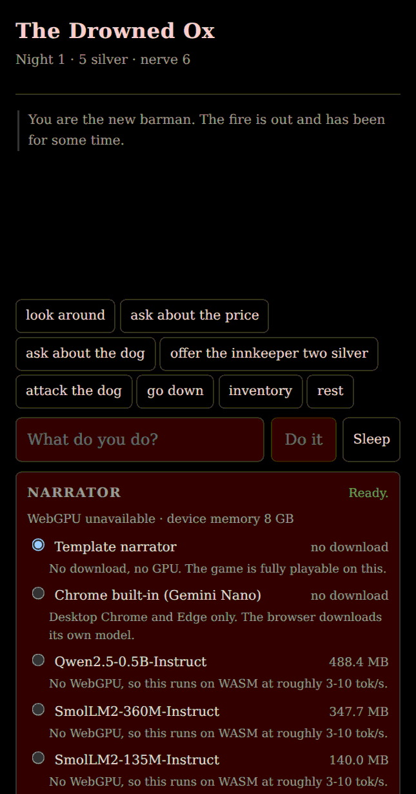

# The Drowned Ox

An absurd-comedy tavern game whose narrator runs entirely on-device. No server, no API key, no network once the model is downloaded.

The premise: you are the new barman of an inn where nothing works as advertised, and everyone in it lies to you.



## The one idea this project is built on

> **The engine decides. The model describes.**

A language model small enough to download on a phone cannot hold game state. Give it that job and it will contradict itself three turns later. So it does not have that job.

```
you type: "try to bribe the innkeeper"
   │
   ├─ intent     deterministic  →  { verb: 'bribe', target: 'innkeeper' }
   ├─ rules      deterministic  →  legal? dice rolled, effects computed
   ├─ effects    deterministic  →  new world state        ← the truth lives here
   └─ narrator   on-device LLM  →  prose describing what already happened
                                      ↑ zero authority over state
```

The narrator is handed a brief: a `beat`, a few engine-written facts, who is in the room, and a one-line chronicle. It returns prose and nothing else. It never emits JSON, never sees the full transcript, never decides anything.

That is also where the comedy comes from. The engine computes an absurd outcome — the innkeeper raises the price while taking your bribe, the dog respects you after you miss — and the model's only job is to describe it as though it were perfectly normal. **The comedy does not depend on model quality.** A better model improves the prose; it does not make the game funnier.

## Tiers

| Tier | Backend | Download | Notes |
| --- | --- | --- | --- |
| Zero | Template narrator | 0 B | No GPU, no network, works on iOS. Fully playable. |
| Free | Chrome Prompt API | 0 B | Desktop Chrome and Edge only. Gemini Nano, managed by the browser. |
| Lite | SmolLM2-360M | 260 MB | Mobile and poor connections. |
| Standard | Qwen2.5-0.5B-Instruct | 461 MB | Default. |

Download size varies with the device because the quantization does: `q4f16` on WebGPU, `uint8` on the WASM fallback.

Weights live in OPFS, not Cache Storage — Cache Storage fails to store responses in the hundreds of megabytes, which was found the hard way during the spike.

## Status

| Milestone | State |
| --- | --- |
| M0 spike | Done. Harness validated. Template tier 20/20. 0.5B verdict **pending a real device.** |
| M1 scaffold | Done. React 19, zustand, vite-plugin-pwa. |
| M2 engine | Done. Pure, no mocks, 5-seed playtest clean. |
| M3 narrator | Done. Four backends, worker inference, streaming, abort, quota guards. |
| M4 UI | Done. Playable end to end. |
| M5 PWA | Done. Installable, offline, 871 KB precache, cross-origin isolated. |
| M6 demo | Done. Pages workflow, demo GIF, this README. |

## Verified

Every claim below was checked by a command, not by inspection:

- **typecheck, lint, 240 tests** pass. No test in the engine uses a mock: the engine is pure, so it is tested directly.
- **`npm run playtest`** plays five seeds through the real loop and reports format failures. Currently zero.
- **`npm run smoke`** builds the production bundle, serves it, and drives a real browser: it plays turns, checks the service worker registered, goes offline, reloads, and asserts the game still boots with zero console errors. 20 checks.
- **`npm run demo`** records a playthrough and encodes `demo/drowned-ox.gif`. The encoder is dependency-free; `tools/gif.test.ts` round trips 49 index sequences and the resulting GIF was verified pixel-for-pixel against the source screenshot.

See [`spike/README.md`](spike/README.md) for the measurement, including what could not be measured and why.

## Working on it

```bash
npm install
npm run dev        # the game at localhost:5173/osteria-del-locale/
npm test           # vitest, then the playtest
npm run lint
npm run typecheck
npm run build
npm run smoke      # production build in a real browser, including offline
npm run demo       # record demo/drowned-ox.gif
npm run spike      # the narrator benchmark
npm run gate       # all of the above, in order
```

Deployment is `.github/workflows/deploy.yml`: it gates on typecheck, lint, tests and a real-browser smoke run, and only then publishes to GitHub Pages.

## Layout

```
src/
  engine/       pure rules. no React, no navigator.*, no DOM. 173 tests, no mocks
  narrator/     the narrator layer: interface, prompt, four backends, worker
  platform/     capability probing, storage quota, OPFS model cache, haptics
  state/        two zustand stores: the game, and the narrator
  ui/           transcript, input, model panel
spike/          the benchmark harness (not shipped)
tools/          playtest, smoke, demo capture, a dependency-free GIF encoder
```

`engine/` is the reason the whole design holds. It has no browser dependency at all, which is why its tests need no mocks and why the same code can run under `tools/playtest.mjs` in plain Node.

The spike shares `src/narrator/` on purpose: it measures the code that ships, not a copy of it.