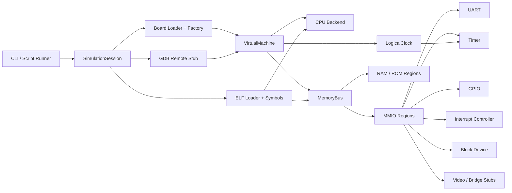

# PolarFire VP Architecture

## Technical overview

PolarFire VP is organized around a small number of stable interfaces:

- Board description: external YAML files describe CPU backend, memory regions, peripherals and IRQ lines.
- Virtual machine core: owns the memory bus, clock, CPU backend and peripheral set.
- CPU abstraction: isolates instruction execution from orchestration, debug and platform description concerns.
- Peripheral framework: MMIO-first device models with logging hooks and optional logical-time callbacks.
- Debug services: ELF loader, symbol table and GDB RSP stub are layered on top of the machine, not embedded inside the CPU model.

This separation keeps the project usable for firmware bring-up today while preserving a clean path to a more realistic backend later.

## Module diagram

## Core subsystems

### Virtual machine

The virtual machine is the orchestration boundary.

- Owns reset, run, stop and stepping.
- Schedules all runnable harts in round-robin order.
- Advances logical time one instruction at a time.
- Detects software breakpoints.
- Carries the symbol table used for tracing and symbolic breakpoints.

Each hart has explicit state:

- `running`
- `halted`
- `waiting-for-interrupt`
- `stopped`
- `faulted`

The VM does not know instruction semantics; that stays inside the CPU backend.

### CPU abstraction

`CpuBackend` is the contract for every execution engine.

Required capabilities:

- PC management and register access.
- Single-step execution.
- Register serialization for GDB.
- Breakpoint tracking.

The current backend is `RiscV64FunctionalCpu`.

Current multi-hart stance:

- one E51 monitor hart and four U54 application harts are modeled in the PolarFire VK example board;
- per-hart `mhartid`, reset PC and boot state are configurable in YAML;
- secondaries can be parked and released by the shell or test harness.

Tradeoff:

- Python keeps the implementation readable and debuggable.
- Functional interpretation is enough for early boot, UART prints, polling loops and MMIO-centric bring-up.
- Unsupported instructions fail loudly, which is better than silent misexecution in a bring-up tool.

### Memory subsystem

The memory subsystem provides:

- Region mapping with overlap detection.
- RAM, ROM and MMIO regions.
- Direct blob loading for ELF segments.
- Illegal-access detection with explicit exceptions.

This is the foundation for both firmware execution and debug memory inspection.

### Peripheral framework

Peripherals implement a common `read`/`write` MMIO contract.

- UART: console-oriented transmit path plus optional RX injection.
- Boot controller: HSS/HLS-like launch mailbox used by E51 firmware to program per-hart launch metadata, HLS status markers and board handoff fields, with CLINT `MSIP` providing the actual wake event.
- Timer: logical-time counter and compare interrupt generation.
- CLINT: per-hart software interrupts, timer compare registers and shared logical `mtime`.
- GPIO: direction and output state for driver bring-up.
- Simple interrupt controller: pending/enable/claim model with per-hart contexts and external interrupt delivery.
- Block device: minimal storage abstraction for boot and filesystem bring-up tests.
- Stub peripherals: register-visible placeholders for video and bridge subsystems.

### ELF and debug support

The ELF loader uses `pyelftools` and performs:

- PT_LOAD segment placement;
- `.bss` style zero fill through `p_memsz > p_filesz`;
- symbol extraction from `.symtab`.

The GDB stub exposes:

- register read/write;
- memory read/write;
- software breakpoints;
- continue and single-step;
- target XML for RV64 register description.

## Boot handoff model

The VP now includes a boot mailbox peripheral specifically to support a more PolarFire-like E51-led startup story.

Behavior:

- E51 firmware writes a per-hart handoff record into `bootctrl`.
- The aperture includes HSS-inspired launch metadata (`entryPoint`, `privMode`, `flags`) and a board handoff area used by HAL-style U54 startup code.
- The same per-hart aperture also exposes HLS-style status markers such as the WFI indicator used by the MPFS HAL startup.
- E51 raises CLINT `MSIP` for the target U54.
- The parked U54 wakes from `wfi`, reads `hart_jump_ddr_addr` and `hart_jump_ddr` from the board handoff area, then transfers control to the programmed entry point with `mret`.

This is still not a silicon-accurate copy of private PolarFire handoff state, but it is materially closer to the real software model than the previous synthetic release register block because it mirrors two concrete MPFS concepts:

- HLS-style per-hart WFI/status storage used by the bare-metal startup code;
- HSS-style per-U54 launch metadata carrying `entryPoint`, `privMode` and `flags`.
- Board-visible handoff words that let secondary harts poll for a boot decision before jumping into the application.

## Design tradeoffs

### Python-only vs Python + Rust/C++

Chosen for v0: Python-only.

Reasoning:

- The first bottleneck is architecture and workflow definition, not instruction throughput.
- YAML parsing, scriptability, ELF handling and GDB plumbing are all naturally expressed in Python.
- The current CPU backend is deliberately replaceable once a native core becomes justified by workload complexity.

Deferred option: Python + Rust.

- Best future path when throughput matters but orchestration should remain in Python.
- Suitable for a native CPU core, DMA engines or fast peripheral models.

Deferred option: Python + C++.

- Still valid, but Rust offers stronger safety for evolving emulator backends.

## PolarFire-specific modeling stance

The project models the PolarFire SoC Video Kit as a firmware-oriented software platform, not as an electrical reproduction.

Current focus:

- MSS-oriented CPU execution.
- Software-visible memory map.
- UART, timer, GPIO, interrupt routing and storage abstraction.
- Stubbed high-bandwidth video/network subsystems.

Explicitly out of scope in v0:

- cycle accuracy;
- FPGA fabric timing;
- signal-level modeling;
- high-speed protocol fidelity.

## Roadmap

### Near term

- Broaden ISA coverage and CSR/trap behavior.
- Add richer storage commands and DMA-visible side effects.
- Improve GDB stop reasons and symbol-aware diagnostics.
- Add script assertions for regression testing.

### Medium term

- Introduce a native RV64 backend behind `CpuBackend`.
- Model PLIC/CLINT semantics more accurately, including priorities and thresholding.
- Support RTOS bring-up scenarios with timer interrupts and context switches.

### Longer term

- Add remote co-simulation hooks for external device models.
- Provide a richer text UI for tracing, symbols and peripheral state.
- Support reusable board families beyond PolarFire VK.
