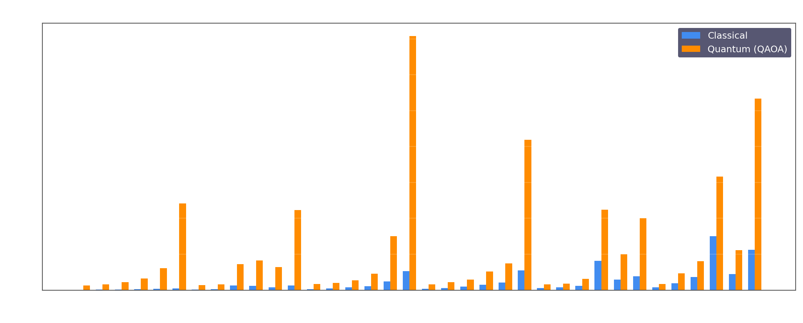
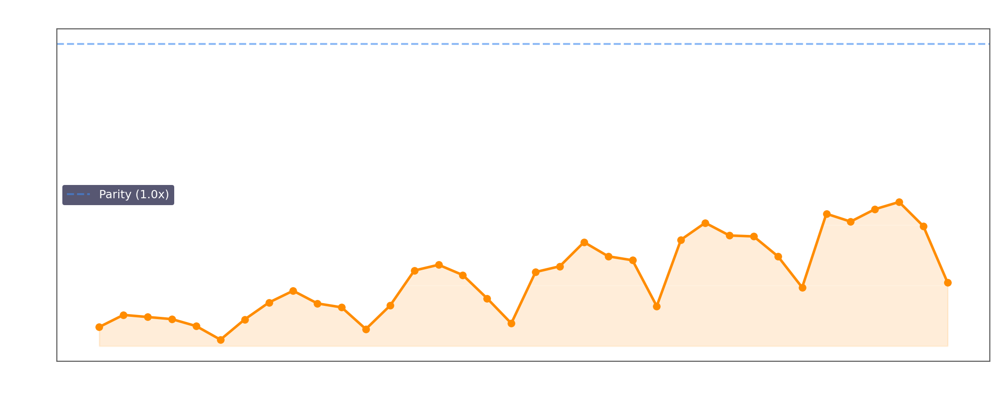
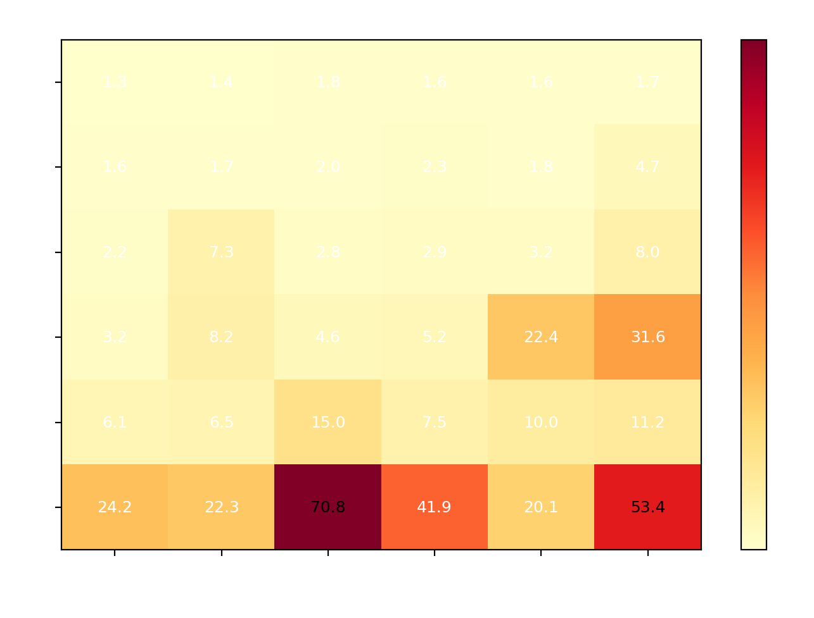
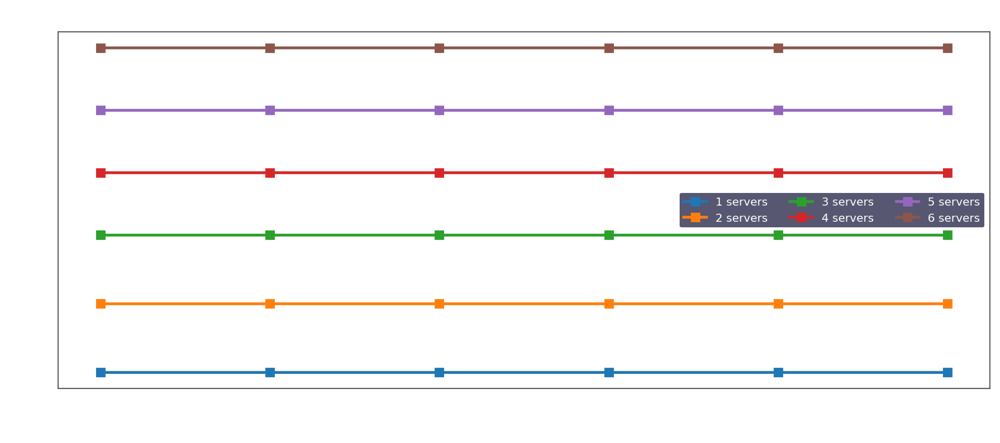

# Report di Progetto Universitario

## Quantum vs Classical Optimization for Server-VM Workload Placement

**Cartella di riferimento:** `MailProgettoTesi/11`  
**Data del report:** 30 maggio 2026  
**Formato:** relazione tecnica in Markdown  

---

## Abstract

Il presente progetto studia un problema di ottimizzazione per l'allocazione di carico tra server fisici e macchine virtuali, implementato con Qiskit 1.x, DOcplex e Qiskit Optimization. L'obiettivo e confrontare due pipeline risolutive basate sul medesimo modello matematico e sul medesimo schema ADMM: una pipeline classica, in cui il sottoproblema combinatorio viene risolto con `NumPyMinimumEigensolver`, e una pipeline quantistica simulata, in cui lo stesso sottoproblema viene risolto con `QAOA` tramite `StatevectorSampler`.

La cartella `11` contiene non solo gli script di esecuzione e di aggregazione dei risultati, ma anche strumenti di diagnosi, grafici intermedi e una presentazione finale in PowerPoint. L'intera campagna sperimentale copre 36 istanze, generate dalla griglia `N, M in {1, ..., 6}`, con successo completo per entrambi i solver. I risultati mostrano che, nel contesto di simulazione adottato, il solver classico e sistematicamente piu rapido del solver quantistico simulato, pur restituendo esattamente gli stessi valori obiettivo e gli stessi vettori di soluzione.

Il contributo principale del progetto non consiste quindi nel mostrare un vantaggio prestazionale quantistico, ma nel costruire e validare una pipeline sperimentale coerente, riproducibile e adatta a discutere il ruolo di approcci ibridi classico-quantistici per problemi di ottimizzazione.

**Parole chiave:** Qiskit, QAOA, ADMM, ottimizzazione ibrida, server allocation, VM placement, quantum simulation.

---

## Indice

1. [Obiettivi del progetto](#obiettivi-del-progetto)
2. [Contesto e motivazione](#contesto-e-motivazione)
3. [Formulazione del problema](#formulazione-del-problema)
4. [Architettura della soluzione](#architettura-della-soluzione)
5. [Struttura della cartella 11](#struttura-della-cartella-11)
6. [Dettagli implementativi](#dettagli-implementativi)
7. [Setup sperimentale](#setup-sperimentale)
8. [Risultati quantitativi](#risultati-quantitativi)
9. [Analisi critica dei risultati](#analisi-critica-dei-risultati)
10. [Limiti metodologici](#limiti-metodologici)
11. [Riproducibilita](#riproducibilita)
12. [Materiali consegnati](#materiali-consegnati)
13. [Conclusioni](#conclusioni)
14. [Appendice A - Struttura dei file JSON](#appendice-a---struttura-dei-file-json)
15. [Appendice B - Inventario dei principali file della cartella](#appendice-b---inventario-dei-principali-file-della-cartella)

---

## Obiettivi del progetto

Gli obiettivi del progetto possono essere distinti in tre livelli.

### 1. Obiettivo modellistico

Formalizzare un problema di allocazione di carico tra server e macchine virtuali come problema di ottimizzazione con:

- variabili binarie per lo stato dei server
- variabili continue per l'allocazione di carico
- variabili continue per il livello minimo di CPU associato alle VM

### 2. Obiettivo algoritmico

Confrontare due strategie di risoluzione che condividono la stessa decomposizione ADMM:

- una variante classica
- una variante quantistica simulata

### 3. Obiettivo sperimentale

Verificare:

- la correttezza della pipeline implementativa
- la fattibilita numerica delle soluzioni prodotte
- l'accordo tra valori obiettivo e soluzioni dei due solver
- l'andamento dei tempi di esecuzione al crescere della dimensione del problema

---

## Contesto e motivazione

Il problema affrontato appartiene alla famiglia dei problemi di resource allocation in ambienti cloud e data center. In contesti reali, una piattaforma di virtualizzazione deve decidere come distribuire un certo insieme di macchine virtuali su un certo insieme di server fisici, minimizzando costi energetici e di utilizzo pur rispettando vincoli di capacita e carico.

Dal punto di vista metodologico, il progetto si colloca nell'ambito dell'ottimizzazione ibrida classico-quantistica. L'idea e sfruttare una decomposizione ADMM per separare il problema in:

- una parte discreta, potenzialmente compatibile con una formulazione QUBO e quindi con algoritmi quantistici variazionali come QAOA
- una parte continua, risolta con strumenti di ottimizzazione classica

Questo approccio e interessante perche consente di studiare il contributo del componente quantistico non su un problema artificiale isolato, ma all'interno di un workflow di ottimizzazione completo.

---

## Formulazione del problema

Il problema viene costruito in [qiskit_opt.py](qiskit_opt.py) e poi convertito in un `QuadraticProgram` di Qiskit.

### Variabili decisionali

- `s_i in {0,1}`: stato del server `i`
- `v_{j,i} >= 0`: quota di carico della VM `j` allocata sul server `i`
- `u_j >= min_cpu_per_vm`: livello minimo di CPU associato alla VM `j`

### Funzione obiettivo

La funzione obiettivo implementata nel codice e:

$$
\min \sum_{i=1}^{N} \left( \pi_i s_i + \delta_i \sum_{j=1}^{M} u_j v_{j,i} \right)
$$

dove:

- `pi_i` rappresenta il costo fisso di attivazione del server `i`
- `pd_i` rappresenta il peso del costo dinamico associato all'utilizzo delle risorse

Nel dataset sperimentale salvato in `11`, tutti i coefficienti sono impostati a `1.0`.

### Vincoli

Il modello impone i seguenti vincoli principali:

1. **Vincolo di carico sui server**

$$
\sum_{j=1}^{M} v_{j,i} \geq capacities_i - 1 \qquad \forall i
$$

2. **Vincolo di attivazione dei server**

Quando `require_all_on = True`, ogni server e vincolato a essere acceso:

$$
s_i = 1 \qquad \forall i
$$

3. **Vincolo di allocazione massima per VM**

$$
\sum_{i=1}^{N} v_{j,i} \leq limit_j \qquad \forall j
$$

4. **Vincolo di CPU minima per VM**

$$
u_j \geq min\_cpu\_per\_vm \qquad \forall j
$$

### Dimensione del problema

Per una coppia `(N, M)`:

- variabili binarie: `N`
- variabili continue di allocazione: `N * M`
- variabili continue CPU: `M`

Numero totale di variabili:

$$
N + N M + M = N + M(N + 1)
$$

Nel caso massimo testato, `N = 6` e `M = 6`, il problema contiene `48` variabili complessive.

---

## Architettura della soluzione

L'architettura algoritmica del progetto e ibrida ed e organizzata attorno a una decomposizione ADMM.

### Pipeline classica

- modello DOcplex
- conversione in `QuadraticProgram`
- decomposizione ADMM
- sottoproblema discreto risolto con `NumPyMinimumEigensolver`
- sottoproblema continuo risolto con COBYLA

### Pipeline quantistica simulata

- stesso modello DOcplex
- stessa conversione in `QuadraticProgram`
- stessa decomposizione ADMM
- sottoproblema discreto risolto con `QAOA`
- sottoproblema continuo risolto con COBYLA

### Principio del confronto

Il confronto e corretto perche le due pipeline differiscono soltanto nel metodo usato per il sottoproblema QUBO. Tutto il resto della pipeline rimane invariato.

---

## Struttura della cartella 11

La cartella `MailProgettoTesi/11` rappresenta una pipeline completa di progetto e non una semplice cartella di script.

### Script principali

| File | Ruolo |
|---|---|
| [qiskit_opt.py](qiskit_opt.py) | Costruzione del modello, risoluzione classica e quantistica, salvataggio output |
| [run_batch_qiskit.py](run_batch_qiskit.py) | Esecuzione batch delle 36 istanze |
| [merge_results.py](merge_results.py) | Aggregazione dei risultati in JSON e CSV |
| [create_pptx.py](create_pptx.py) | Generazione della presentazione finale in PowerPoint |

### Script ausiliari di diagnosi

| File | Funzione |
|---|---|
| [check_batch.py](check_batch.py) | Ispezione dei risultati batch |
| [diagnose.py](diagnose.py) | Diagnosi di casi problematici |
| [inspect_infeasible.py](inspect_infeasible.py) | Ispezione di eventuali classificazioni `INFEASIBLE` |
| [test_feasibility.py](test_feasibility.py) | Verifica puntuale dei controlli di fattibilita |
| `check_7a*.py` | Script storici di debug relativi a una cartella precedente (`7a`) |

### Artefatti sperimentali e documentali

| Artefatto | Significato |
|---|---|
| `q_20260325_*.json` | Risultati dettagliati di singole istanze |
| `q_20260325_*.png` | Grafici per singola istanza |
| [merged_20260325_165037.json](merged_20260325_165037.json) | Merge completo delle run |
| [merged_20260325_165037.csv](merged_20260325_165037.csv) | Tabella aggregata dei risultati |
| [batch_runs](batch_runs) | Log della campagna batch |
| [_pptx_charts](./_pptx_charts) | Grafici intermedi per la presentazione |
| [Qiskit_Optimization_Results.pptx](Qiskit_Optimization_Results.pptx) | Presentazione finale |
| [README.md](README.md) | Descrizione sintetica della cartella |

---

## Dettagli implementativi

### Costruzione del modello

Lo script [qiskit_opt.py](qiskit_opt.py) esegue i seguenti passaggi:

1. installa automaticamente i pacchetti Python richiesti, se necessario
2. legge i parametri da CLI
3. genera i vettori `pi`, `pd`, `capacities`, `vm_allocation_limits`
4. esegue un pre-check di fattibilita strutturale
5. costruisce il modello DOcplex
6. converte il modello in `QuadraticProgram`
7. risolve la stessa istanza con due pipeline diverse
8. applica una procedura di correzione numerica finale
9. salva JSON e immagine PNG

### Parametri ADMM

Nella modalita completa salvata nei risultati della cartella `11`:

- `rho_initial = 100`
- `beta = 1000`
- `factor_c = 900`
- `three_block = True`
- `tol = 1e-4`
- `maxiter = 100` per la pipeline classica
- `maxiter = 300` per la pipeline quantistica simulata

### Configurazione QAOA

La componente quantistica simulata usa:

- `StatevectorSampler`
- `COBYLA(maxiter=300)`
- `reps = 3`

In modalita `--fast`, i parametri vengono ridotti a:

- `COBYLA(maxiter=50)`
- `reps = 2`

### Pre-check di fattibilita

Prima di lanciare ADMM, il codice verifica la condizione necessaria:

```text
sum(vm_allocation_limits) >= sum(capacities) - n_servers
```

Questa scelta evita di investire tempo di calcolo in istanze strutturalmente infeasible.

### Procedura `snap_to_feasible()`

Uno degli aspetti piu importanti dell'implementazione e la funzione `snap_to_feasible()`. La ragione della sua introduzione e che ADMM produce talvolta soluzioni quasi fattibili, ma affette da piccole violazioni numeriche dell'ordine di `1e-4`. Qiskit, tuttavia, utilizza un controllo di fattibilita molto rigoroso.

La funzione:

- clampa le variabili ai bound ammessi
- corregge iterativamente vincoli di tipo `>=` e `<=`
- evita oscillazioni tra vincoli in conflitto
- aggiorna `status` e `fval` del risultato quando la soluzione corretta diventa fattibile

La presenza nella cartella di vari script di diagnostica conferma che questa fase non e un dettaglio marginale, ma un elemento metodologico decisivo della pipeline.

### Generazione della presentazione finale

Lo script [create_pptx.py](create_pptx.py) costruisce una presentazione di 14 slide comprendente:

- introduzione del problema
- formulazione matematica
- spiegazione della decomposizione ADMM
- discussione della procedura `snap_to_feasible()`
- grafici di successo, tempi, speedup, heatmap di scaling e valori obiettivo
- tabella completa dei risultati
- conclusioni e prospettive future

---

## Setup sperimentale

La campagna di test presente in `11` e stata eseguita tramite [run_batch_qiskit.py](run_batch_qiskit.py).

### Griglia delle istanze

- `n_servers in {1, 2, 3, 4, 5, 6}`
- `n_vms in {1, 2, 3, 4, 5, 6}`
- totale istanze: `36`

### Parametri di default del modello

| Parametro | Valore |
|---|---|
| `require_all_on` | `True` in tutte le run salvate |
| `min_cpu_per_vm` | `1.0` |
| `pi_list` | tutti i valori a `1.0` |
| `pd_list` | tutti i valori a `1.0` |
| `capacities` | `11` per i primi 3 server, `10` per i successivi |

### Costruzione di `capacities`

Per una istanza con `N` server, il vettore di capacita usato di default e:

- `N = 1`: `[11]`
- `N = 2`: `[11, 11]`
- `N = 3`: `[11, 11, 11]`
- `N = 4`: `[11, 11, 11, 10]`
- `N = 5`: `[11, 11, 11, 10, 10]`
- `N = 6`: `[11, 11, 11, 10, 10, 10]`

### Costruzione di `vm_allocation_limits`

Nel batch, i limiti per le VM vengono costruiti con una funzione `safe_vm_alloc()` che:

- garantisce la fattibilita del vincolo di carico complessivo
- aggiunge un margine di sicurezza del 25%
- introduce una piccola perturbazione casuale tra `0` e `3`

### Osservazione importante sul setup

Tutte le run salvate nella cartella hanno `require_all_on = True`. Questo significa che le variabili binarie dei server sono fissate a `1` da un vincolo esplicito. Da un punto di vista scientifico, questo e un elemento cruciale: il progetto valuta molto bene la consistenza della pipeline ibrida, ma attenua il carattere realmente decisionale della parte combinatoria sui server on/off.

---

## Risultati quantitativi

I dati numerici riportati di seguito sono stati ricavati direttamente da [merged_20260325_165037.csv](merged_20260325_165037.csv) e dai file JSON delle singole run.

### Sintesi globale

| Metrica | Valore |
|---|---|
| Numero totale di istanze | 36 |
| Successi pipeline classica | 36 / 36 |
| Successi pipeline quantistica simulata | 36 / 36 |
| Solver piu veloce per tutte le istanze | classico |
| Massima differenza assoluta tra obiettivi classico/quantum | 0.0 |
| Vettori soluzione identici tra i due solver | 36 / 36 |

### Statistiche sui tempi di esecuzione

| Metrica | Classico | Quantum simulato |
|---|---:|---:|
| Tempo medio | 2.294 s | 11.499 s |
| Tempo mediano | 1.047 s | 4.945 s |
| Tempo minimo | 0.080 s | 1.256 s |
| Tempo massimo | 15.080 s | 70.791 s |

### Statistiche su `speedup_x`

Nel CSV, la metrica `speedup_x` e definita come:

```text
speedup_x = classic_time / quantum_time
```

Quindi:

- `speedup_x < 1` significa che il solver classico e piu veloce
- `speedup_x > 1` significherebbe un vantaggio della pipeline quantistica simulata

Per il dataset della cartella `11`:

| Metrica | Valore |
|---|---:|
| Media `speedup_x` | 0.229 |
| Mediana `speedup_x` | 0.222 |
| Minimo `speedup_x` | 0.021 |
| Massimo `speedup_x` | 0.477 |

Tradotto in termini piu intuitivi, la pipeline quantistica simulata risulta tra circa `2.1x` e `47.6x` piu lenta della pipeline classica nelle istanze osservate.

### Casi rappresentativi

| Istanza | Tempo classico | Tempo quantum | Osservazione |
|---|---:|---:|---|
| `1s x 1v` | 0.080 s | 1.256 s | caso minimo |
| `3s x 3v` | 0.744 s | 2.765 s | caso intermedio stabile |
| `6s x 3v` | 5.278 s | 70.791 s | caso piu lento per la pipeline quantistica |
| `4s x 6v` | 15.080 s | 31.640 s | caso piu costoso per la pipeline classica e piu vicino alla parita relativa |
| `6s x 1v` | 0.511 s | 24.165 s | massimo vantaggio relativo del classico |

### Andamento della pipeline quantistica rispetto al numero di server

Tempo medio quantistico per numero di server:

| Numero server | Tempo medio quantum |
|---|---:|
| 1 | 1.557 s |
| 2 | 2.348 s |
| 3 | 4.399 s |
| 4 | 12.558 s |
| 5 | 9.372 s |
| 6 | 38.760 s |

Il trend non e perfettamente monotono, ma e chiaramente crescente al crescere del numero di server, soprattutto nel passaggio a `6` server. Questo e coerente con il fatto che il sottoproblema combinatorio coinvolge `N` variabili binarie e dunque una dimensione di spazio di stato che cresce con il numero di qubit usati da QAOA.

### Andamento rispetto al numero di residuali registrati

Nel CSV il numero di residuali registrati per run e identico tra pipeline classica e pipeline quantistica simulata:

| Numero di residuali salvati | Numero di istanze |
|---|---:|
| 1 | 26 |
| 2 | 6 |
| 3 | 2 |
| 4 | 1 |
| 5 | 1 |

Questo suggerisce che, almeno nei casi salvati, i due solver attraversano pattern di convergenza numericamente coincidenti.

---

## Analisi critica dei risultati

### 1. Correttezza numerica della pipeline

Il risultato piu forte del progetto e che le due pipeline producono:

- esattamente gli stessi valori obiettivo in tutte le 36 istanze
- esattamente gli stessi vettori di soluzione in tutte le 36 istanze

Questo dato e particolarmente importante perche indica che la pipeline quantistica simulata, nel contesto delle istanze testate, non introduce errori di qualita nella soluzione finale rispetto alla pipeline classica.

### 2. Assenza di vantaggio temporale quantistico

La pipeline quantistica simulata e sempre piu lenta della pipeline classica. Questo risultato non e sorprendente, per almeno tre ragioni:

- QAOA viene eseguito in simulazione statevector e non su hardware quantistico reale
- la simulazione esatta di circuiti quantistici ha costi che crescono rapidamente con il numero di qubit
- l'intero workflow include comunque una componente continua risolta classicamente con COBYLA

### 3. Ruolo chiave della procedura `snap_to_feasible()`

Il fatto che la cartella contenga diversi script di diagnosi relativi a falsi `INFEASIBLE` mostra che la fase di post-processing non e cosmetica: essa e necessaria per rendere utilizzabile la pipeline su output ADMM numericamente vicini ai vincoli ma non perfettamente aderenti a livello macchina.

### 4. Obiettivi numericamente molto regolari

Gli obiettivi osservati seguono un pattern regolare:

- circa `11` per `1` server
- circa `22` per `2` server
- circa `33` per `3` server
- circa `43` per `4` server
- circa `53` per `5` server
- circa `63` per `6` server

Questo andamento e coerente con il setup sperimentale adottato:

- tutti i server sono forzati a essere accesi
- tutti i coefficienti di costo sono pari a `1`
- il termine dinamico tende a riflettere il carico minimo richiesto

Ne consegue che il valore obiettivo, pur corretto, discrimina poco tra strategie alternative e descrive soprattutto il carico strutturale imposto dal modello.

---

## Limiti metodologici

Il progetto e solido come dimostrazione di pipeline, ma presenta alcuni limiti che e corretto esplicitare in una consegna universitaria.

### 1. `require_all_on = True` in tutte le run salvate

Questo e probabilmente il limite metodologico piu importante. Se tutti i server devono essere accesi, la parte discreta del problema perde buona parte del suo significato decisionale. Di conseguenza:

- il confronto tra solver resta valido sul piano numerico e implementativo
- ma l'esperimento non misura pienamente la capacita di QAOA di esplorare scelte binarie non banali sui server

### 2. Coefficienti di costo uniformi

Il fatto che `pi_i = 1` e `pd_i = 1` per tutti gli indici rende il problema molto regolare e poco eterogeneo. In scenari piu realistici sarebbe opportuno usare:

- costi di attivazione diversi tra server
- pesi energetici diversi
- vincoli aggiuntivi su memoria, storage, latenza o bilanciamento

### 3. Simulazione quantistica noiseless

L'esecuzione quantistica non avviene su hardware reale, ma tramite `StatevectorSampler`. Pertanto il progetto non fornisce evidenza sperimentale su:

- impatto del rumore
- error mitigation
- costi reali di esecuzione su backend quantistico
- eventuale quantum speedup su dispositivi fisici

### 4. Scalabilita limitata

Le istanze massime si fermano a `6 x 6`. Il progetto mostra che la pipeline funziona bene entro questa soglia, ma non dimostra ancora una scalabilita robusta oltre tale dimensione.

### Nota sulla coerenza con la consegna

Il progetto puo essere letto come uno sviluppo metodologicamente coerente della traccia proposta in [Assignment.pdf](Assignment.pdf), piu che come una sua trascrizione letterale. La consegna richiede infatti di studiare l'applicazione dell'`ADMMOptimizer` di Qiskit a un problema di allocazione VM-server in un contesto mixed-binary constrained; questo impianto generale e stato mantenuto, sia nel dominio applicativo sia nella scelta del framework algoritmico e della decomposizione tra sottoproblema discreto e sottoproblema continuo.

Le differenze rispetto alla formulazione proposta nel PDF riguardano soprattutto la modellazione interna del problema. In particolare, il progetto usa variabili continue per la distribuzione del carico, introduce il vincolo `require_all_on = True` nelle istanze archiviate e adotta una struttura dei vincoli orientata alla stabilita numerica e alla riproducibilita del benchmark. Queste scelte non alterano il tema scientifico del lavoro, ma collocano il progetto nel quadro di un caso di studio controllato, pensato per validare la pipeline e analizzarne il comportamento sperimentale.

In questa prospettiva, il progetto va considerato come una validazione metodologica dell'uso di ADMM in Qiskit su un problema server/VM, costruita per verificare correttezza della pipeline, fattibilita delle soluzioni, confronto classico-quantistico e comportamento numerico dell'implementazione. Un naturale sviluppo futuro, pienamente in continuita con la consegna originale, consisterebbe nell'avvicinare ulteriormente il modello alla formulazione del PDF, reintroducendo variabili di assegnazione binarie, vincoli di capacita del tipo `<= C_i s_i` ed eventuale estrazione esplicita dei sottoproblemi interni generati da ADMM.

---

## Riproducibilita

La cartella `11` e stata organizzata in modo riproducibile. I passaggi minimi per ricostruire l'esperimento sono i seguenti.

### 1. Esecuzione di una singola istanza

```bash
python qiskit_opt.py --n_servers 3 --n_vms 2
```

### 2. Esecuzione batch completa

```bash
python run_batch_qiskit.py
```

### 3. Aggregazione dei risultati

```bash
python merge_results.py
```

### 4. Rigenerazione della presentazione

Se il nome del CSV aggregato cambia, occorre prima aggiornare la costante `CSV` in [create_pptx.py](create_pptx.py), poi eseguire:

```bash
python create_pptx.py
```

### Dipendenze principali

- `qiskit`
- `qiskit-aer`
- `qiskit-algorithms`
- `qiskit-optimization`
- `docplex`
- `cplex`
- `numpy`
- `matplotlib`
- `python-pptx`

---

## Materiali consegnati

La cartella `11` fornisce gia un pacchetto di consegna quasi completo. I materiali piu rilevanti sono:

1. **Codice sorgente**

- [qiskit_opt.py](qiskit_opt.py)
- [run_batch_qiskit.py](run_batch_qiskit.py)
- [merge_results.py](merge_results.py)
- [create_pptx.py](create_pptx.py)

2. **Risultati sperimentali**

- [merged_20260325_165037.csv](merged_20260325_165037.csv)
- [merged_20260325_165037.json](merged_20260325_165037.json)
- singoli file `q_20260325_*.json`

3. **Documentazione e sintesi**

- [README.md](README.md)
- [Qiskit_Optimization_Results.pptx](Qiskit_Optimization_Results.pptx)
- il presente report [REPORT_PROGETTO_UNIVERSITARIO.md](REPORT_PROGETTO_UNIVERSITARIO.md)

---

## Figure e grafici

### Confronto temporale tra solver



*Figura 1. Tempo di esecuzione della pipeline classica e della pipeline quantistica simulata per tutte le 36 istanze.*

### Analisi dello speedup



*Figura 2. Andamento della metrica `speedup_x = classic_time / quantum_time`. Tutti i valori sono inferiori a 1, quindi il classico e sempre piu veloce.*

### Heatmap dello scaling quantistico



*Figura 3. Heatmap del tempo della pipeline quantistica simulata. L'aumento del numero di server incide piu del numero di VM.*

### Valori obiettivo



*Figura 4. I valori obiettivo crescono in modo regolare con il numero di server e coincidono esattamente tra solver classico e quantistico.*

### Esempio di output per singola istanza


*Figura 5. Esempio di output grafico per una singola istanza salvata nella cartella. I vettori soluzione classico e quantum coincidono.*

---

## Conclusioni

Il progetto contenuto in `MailProgettoTesi/11` rappresenta un caso di studio universitario solido e completo sull'uso di Qiskit per il confronto tra ottimizzazione classica e quantistica simulata in un contesto di allocazione server/VM.

I risultati consentono di affermare con chiarezza che:

- la pipeline implementata e corretta e riproducibile
- entrambe le varianti del solver producono sempre soluzioni fattibili
- le soluzioni classiche e quantistiche simulate coincidono esattamente su tutte le istanze archiviate
- la pipeline classica e sempre piu rapida, con un vantaggio medio netto rispetto alla simulazione quantistica

Dal punto di vista accademico, il progetto ha valore soprattutto per tre motivi:

1. mostra come costruire un workflow ibrido reale, e non solo un esempio isolato di algoritmo quantistico
2. documenta con chiarezza il problema numerico della fattibilita e la relativa soluzione tramite `snap_to_feasible()`
3. produce un insieme completo di artefatti: codice, output grezzi, merge dei risultati, grafici, slide e report

La conclusione scientifica principale e che, nel setup attuale, non emerge alcun vantaggio prestazionale del solver quantistico simulato. Tuttavia, il progetto fornisce una base metodologica credibile e ben strutturata per lavori futuri, in particolare se si desidera:

- rimuovere il vincolo `require_all_on = True`
- introdurre costi e vincoli piu realistici
- usare backend quantistici reali invece della sola simulazione statevector

---

## Appendice A - Struttura dei file JSON

Ogni file `q_YYYYMMDD_HHMMSS_results.json` contiene:

| Campo | Contenuto |
|---|---|
| `script` | nome logico dello script (`q`) |
| `meta` | numero di server, numero di VM, flag `require_all_on` |
| `input` | parametri di ingresso: costi, capacita, limiti, CPU minima |
| `qp_lp` | esportazione LP del problema DOcplex convertito |
| `classic` | risultato classico: obiettivo, status, soluzione `x`, residuali, tempo |
| `quantum` | risultato quantistico simulato: obiettivo, status, soluzione `x`, residuali, tempo |
| `combined_image` | nome del file PNG associato |

Questa struttura rende ogni istanza autosufficiente sia per analisi numerica sia per audit del modello.

---

## Appendice B - Inventario dei principali file della cartella

| Percorso | Descrizione |
|---|---|
| [qiskit_opt.py](qiskit_opt.py) | script principale di ottimizzazione |
| [run_batch_qiskit.py](run_batch_qiskit.py) | batch runner |
| [merge_results.py](merge_results.py) | merge JSON e CSV |
| [create_pptx.py](create_pptx.py) | generatore della presentazione |
| [merged_20260325_165037.csv](merged_20260325_165037.csv) | tabella aggregata dei risultati |
| [merged_20260325_165037.json](merged_20260325_165037.json) | raccolta completa delle run |
| [_pptx_charts](./_pptx_charts) | grafici per la presentazione |
| [Qiskit_Optimization_Results.pptx](Qiskit_Optimization_Results.pptx) | presentazione finale |
| [README.md](README.md) | documentazione sintetica della cartella |
| [REPORT_PROGETTO_UNIVERSITARIO.md](REPORT_PROGETTO_UNIVERSITARIO.md) | presente relazione |

---

## Nota finale

Questo report e stato costruito a partire dai file effettivamente presenti nella cartella `MailProgettoTesi/11` e dai risultati sperimentali gia salvati al suo interno. Le affermazioni numeriche riportate derivano dai merge aggregati e dai file JSON delle singole run.